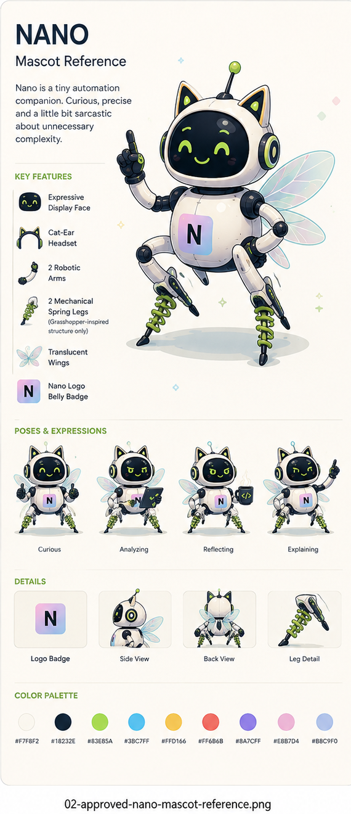

# NanoNative visual language

Status: Draft

## Purpose and scope

NanoNative combines clear technical communication with a curious, approachable
character. Pink and blue establish the brand; neutral surfaces support reading;
green belongs primarily to the mascot and selected supporting accents.

This standard applies to websites, application interfaces, documentation, blogs,
social media, and illustrations. It defines visual relationships and observable
behavior independently of a project, framework, design application, rendering
engine, or publishing platform. A consumer maps these rules to its own tools.

This specification is the standalone source for the design rules and reference
values. Designers and automated tools can apply it directly without loading a
skill or using a particular assistant. The
[ADR](../adr/0001-semantic-visual-language.md) explains the design model. The
[application skill](../../.agents/skills/nano-visual-language/SKILL.md) describes
an optional workflow for applying the same standard and adds no design rules.

MUST indicates a requirement; SHOULD indicates a recommendation; MAY indicates
an optional treatment. Requirements apply where the medium supports the relevant
behavior: a printed poster has no keyboard focus or theme control.

## Identity and adaptation

| Preserve | Adapt to the output |
| --- | --- |
| Pink/blue brand recognition and the original logo | Composition, aspect ratio, crop, and content density |
| Color-role meanings and readable foreground/background relationships | Theme, output color space, and accessible tonal adjustments |
| Clear hierarchy, generous reading space, and precise language | Typeface, type size, spacing, and grid within the rules below |
| Mascot silhouette, anatomy, materials, and personality | Pose, expression, scene, camera angle, and illustration detail |
| Meaning of content, actions, and feedback | Platform-native controls and interaction conventions |

Adaptation is driven by content and available space. A narrow layout may stack
regions, a dense interface may reduce spacing, and a social image may simplify a
scene. These changes must preserve hierarchy, legibility, and identity. Resizing
a complete desktop composition into an unreadable thumbnail is not adaptation.

An output brief specifies purpose, audience, medium, dimensions or available
space, theme, density, content, and publisher. Existing project or channel
settings can supply these values. No particular author, organization footer,
social network, application stack, or repository structure is required.

## Color system

### Identity palette

Values are sRGB references. Brand colors express identity; semantic roles define
how colors function. Pink/blue should be recognizable in a deliberate brand
region, the logo, or supporting artwork without coloring every surface.

| Color | Value | Role in the identity |
| --- | --- | --- |
| Pink | `#FF69B4` | Short accents and expressive brand details |
| Pastel pink | `#FBC2EB` | Pink endpoint of the brand gradient |
| Pastel blue | `#A6C1EE` | Blue endpoint of the brand gradient |
| Blue | `#5799EA` | Supporting blue; adjust tone for readable small text |
| Charcoal | `#333333` | Dark neutral |
| Off-white | `#F9F9F9` | Light neutral |

The signature gradient runs from pastel pink to pastel blue. Use dark ink over
it and keep text over a calm region. Preserve the gradient within the original
logo. Outside the logo it may frame a cover, introduction, or brand region;
reading surfaces and ordinary controls use solid colors.

The illustration palette extends the identity without replacing it:

| Color | Value | Typical use |
| --- | --- | --- |
| Ivory | `#F7F8F2` | Warm illustration ground and robot shell |
| Ink | `#18232E` | Display face, outlines, and dark mechanical parts |
| Green | `#83E85A` | Mascot expression, springs, and selected accents |
| Cyan | `#3BC7FF` | Wing edges and technical illustration details |
| Yellow | `#FFD166` | Small warm accents |
| Coral | `#FF6B6B` | Small warm accents |
| Violet | `#8A7CFF` | Secondary objects and diagram categories |
| Soft pink | `#E8B7D4` | Illustration shading and translucent details |
| Soft blue | `#B8C9F0` | Illustration shading and translucent details |

Illustration shading may vary with material and light. These reference colors
do not require flat fills, and the illustration pink/blue do not replace the
logo's colors. Bright green is not a default page background or text color.

### Semantic roles and themes

Role names describe purpose, not a tool's variable or class syntax. The following
light/dark pairs are the reference mapping. A consumer may translate their names
into its native format while retaining their meaning and pairing. Output color
conversion, transparency, and overlays require checking the resulting colors.

| Role | Light | Dark | Usage |
| --- | --- | --- | --- |
| `surface.canvas` | `#F9F9F9` | `#151A23` | Main background |
| `surface.raised` | `#FFFFFF` | `#202734` | Overlays and distinct surfaces |
| `surface.inset` | `#EEF2F8` | `#25313F` | Code and quiet secondary regions |
| `text.primary` | `#333333` | `#F9F9F9` | Headings, prose, labels, and plain code |
| `text.secondary` | `#536176` | `#B5C1D3` | Metadata and supporting text |
| `text.link` | `#245FAD` | `#A6C1EE` | Inline links |
| `text.emphasis` | `#AD236B` | `#FF88C2` | Short pink emphasis |
| `brand.foreground` | `#18232E` | `#18232E` | Text and indicators on the pastel gradient |
| `border.decorative` | `#D9DEE8` | `#394355` | Nonessential separators |
| `border.control` | `#768298` | `#8090A7` | Necessary control boundaries |
| `action.background` | `#245FAD` | `#A6C1EE` | Primary action fill |
| `action.foreground` | `#F9F9F9` | `#18232E` | Primary action label |
| `action.hover` | `#1D4F92` | `#BDD2F3` | Hover fill; retain the action foreground |
| `focus.ring` | `#245FAD` | `#A6C1EE` | Focus on neutral surfaces |
| `selection.background` | `#FCE9F4` | `#35283A` | Selected item surface |
| `selection.foreground` | `#AD236B` | `#FF88C2` | Selected label and marker |
| `status.success.background` | `#E3F2DA` | `#24392B` | Success notice |
| `status.success.foreground` | `#276B2C` | `#A4EA82` | Success text and icon |
| `status.warning.background` | `#FFF2CE` | `#382F19` | Warning notice |
| `status.warning.foreground` | `#785600` | `#FFD166` | Warning text and icon |
| `status.error.background` | `#FCE7E8` | `#3A232A` | Error notice |
| `status.error.foreground` | `#A52B3A` | `#FF9AA5` | Error text and icon |
| `status.info.background` | `#E3F3FB` | `#183340` | Informational notice |
| `status.info.foreground` | `#165D75` | `#7EDCFF` | Informational text and icon |

Primary, secondary, link, and emphasis text are paired with the three neutral
surfaces. Status and selection foregrounds belong on their matching backgrounds.
Use `brand.foreground` for text and focus on the brand gradient. Necessary control
boundaries and the ordinary focus color are defined against neutral surfaces;
use separation or a contrasting indicator on other backgrounds.

Role-based values may be represented as a table, design styles, native resources,
or a token file. Serialization and integration belong to the consumer. The
[DTCG format](https://www.designtokens.org/tr/2025.10/format/) is an optional
interchange format, not a prerequisite for using this language.

### Color and interaction requirements

| ID | Requirement |
| --- | --- |
| NVL-001 | Functional color choices MUST use named semantic roles with a defined mapping for each supported theme. |
| NVL-002 | Normal text MUST meet 4.5:1 contrast against its actual background; large text MUST meet 3:1, using the definitions and applicable exceptions in [WCAG 1.4.3](https://www.w3.org/WAI/WCAG22/Understanding/contrast-minimum.html). |
| NVL-003 | Visual information needed to identify a control or state MUST meet 3:1 against adjacent colors, with the applicable exceptions in [WCAG 1.4.11](https://www.w3.org/WAI/WCAG22/Understanding/non-text-contrast.html). |
| NVL-004 | Inline prose links MUST be underlined in their normal state. |
| NVL-005 | Keyboard focus MUST remain visibly identifiable and unobscured by clipping, sticky regions, or overlays. |
| NVL-006 | Selection and status MUST communicate meaning through text, shape, or a recognizable marker in addition to color. |

These contrast requirements apply to the final rendered output. Palette checks
alone do not establish accessibility conformance. For print or other converted
output, also inspect a representative proof at its intended reading size.

## Typography, layout, and shape

Use a readable sans-serif with open letterforms and clearly distinguishable
characters. Choose a compatible local or platform typeface where appropriate;
no named font is required. Code uses a legible monospace. Keep ordinary prose
regular, headings and key labels medium or semibold, and emphasis selective.

The following proportions are starting points, not fixed device dimensions.
Let B be the chosen body text size and U be B / 4. Increase B for distance or
small-screen readability rather than shrinking content to fit.

| Element | Reference proportion or treatment |
| --- | --- |
| Body | 1 B, line height around 1.6; aim for 60-75 characters per long-form line |
| Supporting text | Around 0.875 B; retain readability at final output size |
| Section heading | 1.5-1.75 B, line height around 1.25 |
| Main heading | 2-2.75 B, line height around 1.15; allow wrapping |
| Spacing | Use a small repeated scale such as 1, 2, 3, 4, 6, 8, and 12 U |
| Grouping | Space within a group is smaller than space between groups |
| Controls and media | Modest rounding, generally 1-2 U; follow native shapes when needed |
| Elevation | Reserve shadows for meaningful layering or illustration depth |

Use a clear reading axis and align related content. Start with content hierarchy,
then add columns where space supports them. Dense technical material can occupy
a wider region than prose. Do not place every paragraph inside a card.

Icons share a consistent stroke, optical weight, and level of detail. Use familiar
symbols, pair unfamiliar ones with labels, and preserve legibility when scaled.
The interface remains restrained; dimensional toy-like modeling belongs in
illustration. A native control may keep its platform shape and behavior while
adopting compatible type and color roles.

## Interface behavior

Style the states a component actually exposes. The language does not require a
particular component library or introduce new application behavior.

| State | Observable treatment |
| --- | --- |
| Default | Clear label, identifiable boundary where needed, and an appropriate action hierarchy |
| Hover | Visible feedback without layout movement; essential information also works without hover |
| Pressed | Immediate feedback through fill, border, or inset treatment without shifting surrounding content |
| Focus | A distinct indicator separated from filled controls; retain visibility in forced or high-contrast modes |
| Selected | A marker or weight change plus the selection roles; expose the selected state to assistive technology |
| Disabled | Identifiable inactive state; use a native disabled state or its accessible equivalent, with a reason where needed; do not fade the whole control indiscriminately |
| Loading | Stable layout, a clear operation label, and visible progress when known; do not invent progress values |
| Empty | Explain what is absent and give an available next step |
| Success or failure | Use the matching status pair and explicit text; feedback remains understandable without an icon or mascot |

Form fields have persistent labels, distinct focus, and errors associated with
the affected input. Placeholder text does not replace a label. Use native
interaction conventions for navigation, disclosures, menus, and dialogs;
preserve keyboard access and reading order when adapting the layout.

Short transitions may clarify a state change. Avoid continuous decorative
movement near reading content. Motion must not be the only way to communicate
information.

Interactive surfaces offer Light, Dark, and System. System is the initial mode
and follows device preference changes. An explicit selection is remembered on
the device where persistence is available; otherwise it remains effective for
the current session. Expose the selection visibly and programmatically. A missing
theme capability must leave readable content and usable controls. Apply the
selected theme before visible presentation where supported to avoid a flash.
Static images and documents use an explicit output theme and need no selector.

| ID | Requirement |
| --- | --- |
| NVL-007 | Theme changes MUST preserve content, navigation, and available actions. |
| NVL-008 | Reading content MUST remain usable when optional theme selection or decorative rendering is unavailable. |
| NVL-009 | Structured content MUST expose a meaningful heading and reading order through the medium's semantic features where available. |
| NVL-010 | Web reading content MUST reflow at 320 CSS pixels without page-level horizontal scrolling; meaningful two-dimensional content may have a local overflow region, as described in [WCAG Reflow](https://www.w3.org/WAI/WCAG22/Understanding/reflow.html). Other formats MUST remain readable at their intended output size. |
| NVL-011 | Visual styling MUST preserve the text and significant whitespace of technical examples. |
| NVL-012 | When reduced motion is requested, decorative animation MUST stop while content remains visible. |
| NVL-013 | A visual restyle MUST preserve existing navigation destinations and content references, including published links and anchors. |
| NVL-018 | Interactive surfaces with theme support MUST offer Light, Dark, and System, default to System, and remember an explicit choice when local persistence is available. |

## Application by medium

### Websites and application interfaces

Separate navigation, primary content, and supporting information through clear
alignment and spacing. On smaller surfaces, stack or disclose secondary regions
without hiding the current location or primary task. Keep branding recognizable
in the shell while allowing the working area to remain neutral. Layout follows
content and available space rather than device names or fixed breakpoint rules.

Use one dominant action per task region when there is a clear primary task.
Apply the state treatments above to existing controls. Longer labels, translated
content, zoom, and larger text settings must not hide actions or instructions.

### Documentation and technical content

Give the title, introduction, headings, and examples a predictable reading order.
Navigation identifies the current topic and separates section hierarchy from
in-page headings. Technical diagrams use named nodes, explicit connector
meaning, and labels that remain understandable without color.

| Content type | Treatment |
| --- | --- |
| Inline code | Monospace; quiet inset treatment only where it improves recognition |
| Code block | Inset surface, preserved whitespace, language label when useful; local scrolling or format-appropriate wrapping without changing copyable source |
| Syntax | Default code uses `text.primary`; map comments to `text.secondary`, keywords to `text.emphasis`, and literals to `text.link` on neutral surfaces; meaning must survive plain text |
| Table | Clear header relationships and aligned comparable values; use local overflow for genuinely two-dimensional data |
| Callout | A short label and the appropriate status pair; retain ordinary prose for non-status explanations |
| Figure | A caption that explains its purpose; provide a text equivalent for meaningful information |

Screenshots must depict the interface or concept accurately. Decorative mascot
scenes must not be presented as functioning product screenshots.

### Blog and editorial content

A listing distinguishes title, summary, optional cover, and relevant metadata.
An article leads with its subject, then context and body. Keep dates, author,
tags, and reading estimates secondary; include only metadata actually available.
Tags must look interactive only when they provide an interaction.

Artwork supports the argument and uses a declared focal point. Prepare crops
for the listing, article, and link preview separately when their proportions
differ. Essential text belongs in readable content; if a graphic repeats it,
the surrounding article still carries the message.

Link previews are a separate output from on-page images. Supply an appropriate
title, description, canonical destination, and accessible public preview image
in the receiving platform's format. For Open Graph, follow its
[metadata properties](https://ogp.me/), including image alternative text.
A visible article cover does not establish that a link preview is valid.

### Social media and shareable graphics

Build each composition from a message, supporting visual, and publisher identity.
The channel determines dimensions, safe areas, supported media, and export
constraints. Verify those constraints for the intended publication; do not
assume one platform's measurements work everywhere.

| Format family | Composition |
| --- | --- |
| Announcement | One clear headline, the concrete change or benefit, optional supporting visual, and a destination or next step |
| Explainer | A question or claim, a small ordered set of steps or comparisons, and an explanatory visual where useful |
| Quote or observation | A short statement, accurate attribution where applicable, and restrained supporting artwork |
| Multi-panel sequence | One idea per panel, consistent navigation/order cues, and a self-contained final destination |

Adapt landscape, square, and portrait compositions through rearrangement and
selective simplification. Keep headline, logo, and focal subject inside the
channel's safe area. Check thumbnail readability and the actual crop. Use an
opaque background when a platform's treatment of transparency is uncertain.

Keep editable text separate from illustration in the source where the tool
allows it. Captions and alternative descriptions carry the essential message
when image text cannot be read. Export a dedicated preview image rather than a
screen capture of the authoring interface. Publisher and byline are output data;
personal and organizational branding are not interchangeable defaults.

#### Reference composition: editorial portrait post

The LinkedIn reference uses a 4:5 portrait canvas with an airy, text-led
composition. This is an optional authoring profile, not a universal platform
requirement or a fixed layout for other media.

| Region | Treatment |
| --- | --- |
| Left | Large, high-contrast headline or quote with short supporting text |
| Right or upper-right | Nano with a symbolic scene related to the topic |
| Lower-right or lower area | Optional calm reflection scene when it adds meaning |
| Bottom-left | Small publisher footer with a logo, author or organization, and optional brand line |
| Bottom edge | Subtle circuit lines, dots, or procedural motifs |

Use the illustration ivory as the reference ground and ink for the main text.
Selectively emphasize phrases with supporting palette colors only when the
result meets the text-contrast requirements; saturated accents can instead be
used for adjacent graphics. Preserve a clear headline/body hierarchy and avoid
many small text blocks. The footer's author and brand line are supplied for the
particular output; a personal publishing identity is not the default NanoNative
identity. Adapt this composition when content, language, or format requires it.

## Logo and illustration

Use the original NanoNative logo artwork with its pink/blue gradient and dark
lettering. Scale proportionally. Keep clear space around it so nearby text,
edges, or illustrations do not collide with the mark. Choose a size at which the
lettering is legible in the final output; increase its size or use an existing
appropriate variant rather than inventing a new mark.

Do not stretch, mirror, recolor, add effects to, or rebuild the logo from a typed
letter. The mascot's N belly badge is a character detail, not a replacement for
the publisher's logo.

The illustration style is **Bright Procedural Toy-Tech**: bright, calm,
optimistic, smart, playful, and editorial. Use clean 2D vector-like or soft
isometric illustration, crisp outlines, soft shading, controlled highlights,
and restrained contact shadows. These describe appearance, not a required file
format or authoring tool. Aim for medium detail and high readability.

Environments are symbolic, topic-related, stylized, and non-photorealistic.
A small build factory, organized API map, code garden, or abstract thinking
space can explain a concept. Keep backgrounds quieter than the subject, leave
ample space for text, and use procedural patterns sparingly.

Within this illustration style, avoid photography, real human subjects,
realistic animals, generic corporate stock robots, busy interface clutter,
unreadable miniature text, harsh shadows, and horror or dystopian imagery.
The bright mood describes the art direction; it does not require a light UI
theme or prohibit a calm dark background.

Pink/blue connects a scene to NanoNative; green gives the mascot its familiar
expression and mechanical accents. Small cyan, violet, coral, or yellow details
may separate concepts. They should not compete equally for attention. Illustrations
can remain on a deliberate light panel in a dark layout; do not invert or tint
the whole image to manufacture a dark variant.

## Mascot: Nano

Nano is a tiny automation companion: curious, precise, friendly, and mildly dry
about unnecessary complexity. Its role is to explain, investigate, and accompany.
Humor targets needless complexity, never a reader's ability or a failed task.

### Using the written profile

The written anatomy, materials, expressions, and variation rules below, together
with this specification's palette and illustration guidance, define Nano's
character. Use that text as the primary reference for illustration briefs,
generation, and review. Routine use does not require image analysis.

The reference image is an optional visual aid for closer stylistic matching or
clarifying visual detail. It adds no mandatory traits and does not override the
written distinction between required and optional features. If a depiction
differs from the written profile, the written profile governs.

### Identity and anatomy

| Feature | Description to preserve |
| --- | --- |
| Silhouette | A slightly oversized rounded head above a compact rounded torso; balanced, elegant, lightweight proportions without exaggerated chibi anatomy |
| Shell | Smooth, glossy warm off-white or ivory panels with subtle shading, seams, and dark exposed joints; a clean stylized robot shell |
| Face | A glossy dark ink display with simple expressive eyes and mouth, readable at small sizes; lime-green eyes are primary, with cyan accents or variation; no human facial anatomy |
| Headset | An integrated cat-ear headset silhouette with two pointed modules, dark inner panels, green details, and circular side earpieces; no separate animal ears |
| Antenna | Optional: one tiny antenna when it benefits the composition; the reference uses a slim dark stem and round green tip |
| Arms | Exactly two slim, modular, articulated robotic arms, pale shell segments, dark mechanical joints, and expressive hands suited to pointing or holding objects |
| Legs | Exactly two sleek mechanical spring legs with articulated joints, visible coils, and compact feet; grasshopper-inspired structure only, using the mascot palette rather than natural insect coloration or texture |
| Wings | Required paired, small, translucent wings behind the torso; subtle tech-fairy character with layered membranes, fine veins, and a pastel cyan-green tint, allowing soft pink/blue iridescence |
| Belly badge | Required rounded square badge with a soft pastel pink-to-blue gradient and a bold, dark, upright N |

Keep the head expressive and the body compact. The mascot must remain
recognizable in front, side, and rear views. Preserve the paired wing impression
and layered construction; individual visible membranes may overlap or disappear
with perspective. The reference does not define a mechanical engineering model.

Green spring accents belong to the illustration palette; they do not imply a
natural grasshopper body. Keep pale structural panels and dark mechanical joints
visible. The cat-ear silhouette, two arms, two legs, wings, and belly badge are
part of the character even when a pose or crop obscures them. The antenna may be
absent without changing the identity.

Use the N alone on a small belly badge. The word "Nano" may appear only when
clearly readable; reserve it mainly for larger logo or footer placements.

Materials combine a smooth stylized shell, darker polished display, exposed
mechanical joints, and delicate translucent wings. Use coherent lighting and
contact with the scene without photorealistic rendering. Avoid heavy grunge,
chrome glare, or opaque wings that change the character's visual weight.

### Expression and variation

| Mode | Typical expression and pose |
| --- | --- |
| Curious | Open, attentive eyes; slight head tilt or open-handed gesture |
| Analyzing | Concentrated eyes; inspecting a tablet, diagram, or small mechanism |
| Reflecting | Calm face and relaxed pose; a visual pause rather than visible distress |
| Explaining | Alert, friendly expression; pointing to a specific object or concept |
| Organizing | Focused expression; arranging a small set of objects or presenting an icon |
| Observing complexity | Slight concern or playful skepticism directed at a confusing system |

Pose, camera angle, expression, props, scene, and rendering detail may vary.
Tablets, tools, and cups are optional props, not anatomy. Keep gestures physically
coherent and give the gaze or pointing hand a clear subject. Use a simplified
rendering for small placements, reducing scene texture before removing identity
features. A deliberate portrait crop may show only the head and shoulders;
a full-body illustration preserves the complete anatomy.

Do not add limbs, duplicate ears or antennae, turn the character into a furry
cat, replace its display with a human face, or remove the spring-leg identity.
Keep Nano non-human, friendly, and distinct from a generic stock robot. Do not
mirror the N badge or use the eye color as a changing UI status signal.
Expressions may be dry, thoughtful, or slightly concerned without becoming
hostile, mocking, or dystopian.

### Placement and production brief

Use Nano in introductions, conceptual diagrams, editorial covers, explanatory
social posts, or quiet supporting scenes. Keep it outside dense code, essential
navigation, and control labels. A mascot illustration never replaces a status
message, instruction, or required action.

A tool-neutral illustration brief combines:

- Purpose and the single concept the scene should explain.
- The written anatomy and material profile above; an image may accompany it as
  an optional visual aid.
- Expression, pose, prop, and the object of attention.
- Composition, crop, background theme, lighting, and space reserved for text.
- Final dimensions and the smallest expected display size.

Example: "Nano explains a simplified three-step flow. Use the written mascot profile,
curious green display expression, off-white shell, paired translucent wings,
green spring legs, and upright N badge. Position the character beside the flow,
pointing to its first step. Keep the background quiet, retain pink/blue brand
accents, and reserve a clear text region. Adapt framing to the target format."

## Voice and accessible meaning

Use direct, concrete language. Explain a technical idea before adding personality.
Keep labels short and action-oriented. Editorial humor can be lightly dry;
errors, recovery instructions, security explanations, and essential guidance
remain literal and helpful.

| ID | Requirement |
| --- | --- |
| NVL-014 | Meaningful illustrations MUST have an equivalent text explanation; decorative images MUST be marked decorative where the medium supports it. |
| NVL-015 | Mascot variants MUST preserve the identity and anatomy defined in this specification, allowing the stated pose, framing, and rendering variations. |
| NVL-016 | NanoNative logo use MUST preserve the original artwork's geometry, colors, and lettering. |
| NVL-017 | Error and recovery copy MUST state the problem and available next step without jokes or blame. |
| NVL-019 | All required mascot traits and allowed variations MUST be specified in text; reference images and tool-specific skills MUST NOT introduce additional character requirements. |

## Conformance checks

Evaluate each output at its actual public boundary. Apply only checks relevant
to the medium and present features. This table defines checks, not test results.

| Requirements | Observable check |
| --- | --- |
| NVL-001, NVL-002, NVL-003 | Inspect role mappings and rendered foreground/background pairs in supported themes and actual states; verify contrast after transparency, overlays, or color conversion. |
| NVL-004, NVL-005, NVL-006 | Navigate interactive content without a pointer; verify visible focus and identifiable links, selections, and status without relying on hue. |
| NVL-007, NVL-008, NVL-018 | Change theme, reload, change device preference in System mode, and exercise unavailable persistence or optional rendering; confirm usable content and the specified selection behavior. |
| NVL-009, NVL-010 | Inspect reading order and hierarchy; test web reflow and text enlargement, or proof a fixed-format output at its intended size and crop. |
| NVL-011, NVL-013 | Compare example text, copyable content, navigation destinations, and references before and after a visual restyle. |
| NVL-012 | Request reduced motion and verify visible content without decorative animation. |
| NVL-014, NVL-015, NVL-016 | Inspect text alternatives, compare mascot anatomy with the written profile, and compare logo usage with original artwork at final display size. Mascot images may additionally support visual comparison. |
| NVL-017 | Read error or recovery text without its illustration; the problem and available action remain understandable. |
| NVL-019 | With reference images and the application skill unavailable, use this specification to prepare a mascot brief covering anatomy, materials, palette, expressions, and required/optional features. Verify that no required character detail depends on an image or skill. |
| Medium-specific guidance | Inspect the actual crop, output size, content hierarchy, metadata, and link preview where relevant; check the receiving platform when its rendering affects the result. |

A delivery records applicable checks actually performed and any remaining
limitations. Visual consistency, rendered accessibility, and external platform
behavior are separate claims and require their corresponding evidence.
